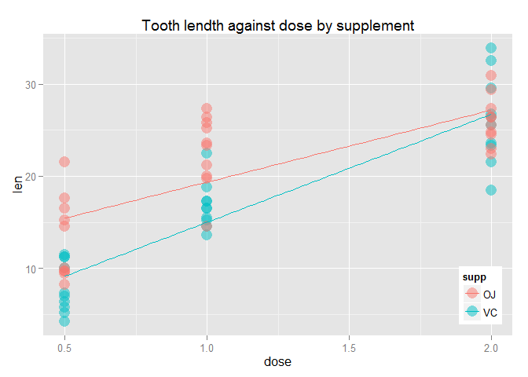

# ToothGrowth
_Data Science / Statistical inference / Peer Assessment 2_   
_Andrey Komrakov_  
_Dec 27 2015_

### Setting up and loading packages

```r
library(datasets)
library(dplyr)
library(ggplot2)
library(knitr)
Sys.setlocale("LC_TIME", "English")
```

### Data Summary

```r
ggplot(ToothGrowth, aes(x=dose, y=len, color=supp)) +
  geom_point(alpha=.5, size=5) +
  stat_smooth(method=lm, se = FALSE) +
  theme(legend.position=c(1,0), legend.justification=c(1,0))+ 
  ggtitle("Tooth lendth against dose by supplement")
```

 

```r
summary(ToothGrowth)
```

```
##       len        supp         dose      
##  Min.   : 4.20   OJ:30   Min.   :0.500  
##  1st Qu.:13.07   VC:30   1st Qu.:0.500  
##  Median :19.25           Median :1.000  
##  Mean   :18.81           Mean   :1.167  
##  3rd Qu.:25.27           3rd Qu.:2.000  
##  Max.   :33.90           Max.   :2.000
```

### Perfoming T-test to investigate the effect of to supplements


```r
t.test(len ~ supp, data = ToothGrowth)
```

```
## 
## 	Welch Two Sample t-test
## 
## data:  len by supp
## t = 1.9153, df = 55.309, p-value = 0.06063
## alternative hypothesis: true difference in means is not equal to 0
## 95 percent confidence interval:
##  -0.1710156  7.5710156
## sample estimates:
## mean in group OJ mean in group VC 
##         20.66333         16.96333
```


### Conclusion
Based on the assumption of independent samples, having got the p-value = 0.061 we can accept the null hypothesis of equivalence of the means of two types of supplement. As the difference in means is not significant in terms of 95% probability, then one can say that both supplements have a similar effect.
