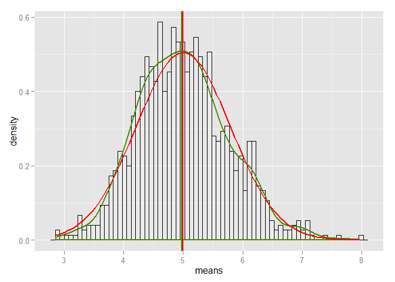

# The exponential distribution simulation
_Data Science / Statistical inference / Peer Assessment 1_   
_Andrey Komrakov_  
_Dec 27 2015_  
_Source files github.com/kolfild26/statinference_  

### Abstract
The document describes the investigation of the exponential distribution in R. The obtained parameters of the simulated distribution of 40 exponentials with $\lambda= 0.2$ is compared to the theoretical ones. Also the normality of the mean distribution will be shown. Thousand simulations are being investigated.


### Setting up and loading packages

```r
library(dplyr)
library(ggplot2)
library(knitr)
Sys.setlocale("LC_TIME", "English")
set.seed(12348)
```

### Input paramerets
Set up input parameters for the exponential distribution

```r
lambda <- .2
samples <- 40
simulations <- 1000
```

### Distribution simulation
Generate a sample mean distribution using the specified parameters. Store it in the **means** vector.

```r
simulation_matrix <- data.frame(matrix(ncol = samples, nrow = simulations))

simulation_func <- function(x,l = lambda) {
  for (i in c(1:nrow(x))) {x[i,] <- rexp(ncol(x), l) }
  y <- apply(x, 1, mean)
  y
}

means <- simulation_func(simulation_matrix, lambda)
```

### Find the actual distribution mean, standard deviation and variance and compare them with theoretical ones.
Theoretical mean **$\mu$** equals $1 /\lambda$ and the actual mean is **mean(means)**


```r
th_mean <- 1/lambda
act_mean <- mean(means)
```

```
## [1] 5
```

```
## [1] 4.999954
```

Theoretical standard deviation equals $1 /\lambda/sqrt(samples)$ and the actual standard deviation is **sd(means)**


```r
th_sd <- 1/lambda/sqrt(samples)
act_sd <- sd(means)
```


```
## [1] 0.7905694
```

```
## [1] 0.7639008
```

Theoretical variance equals _$sd^2$_ and the actual variance is **var(means)**


```r
th_var <-  th_sd^2
act_var <- var(means)
```


```
## [1] 0.625
```

```
## [1] 0.5835445
```


### Show normality
Let's show that the distribution is approximately normal using the t-test.


```r
shapiro.test(means)$p.value
```

```
## [1] 0.000408217
```

```r
shapiro.test(means)
```

```
## 
## 	Shapiro-Wilk normality test
## 
## data:  means
## W = 0.99387, p-value = 0.0004082
```

As we see above the obtained p-value is small enough that we can say of a normal distribution of averages of 40 exponentials.

The figure below also shows graphically the closeness of the actual distribution to the theoretical one.

```r
ggplot() +
  aes(means) +
  geom_histogram(binwidth=.075, alpha = 0.2, aes(y= ..density..), colour="black", fill="white") +
  geom_density(colour="chartreuse4", size=1) +
  geom_vline(xintercept = density(means)$x[which.max(density(means)$y)], size=1, colour="chartreuse4") +
  stat_function(fun = dnorm, arg = list(mean = th_mean , sd = th_sd), colour = "red", size=1) +
  geom_vline(xintercept = th_mean, size = 1, colour = "red")
```

 


